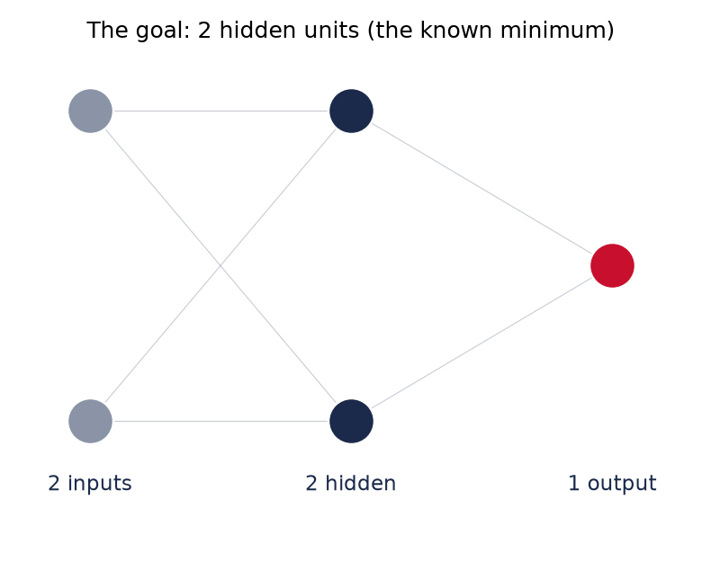
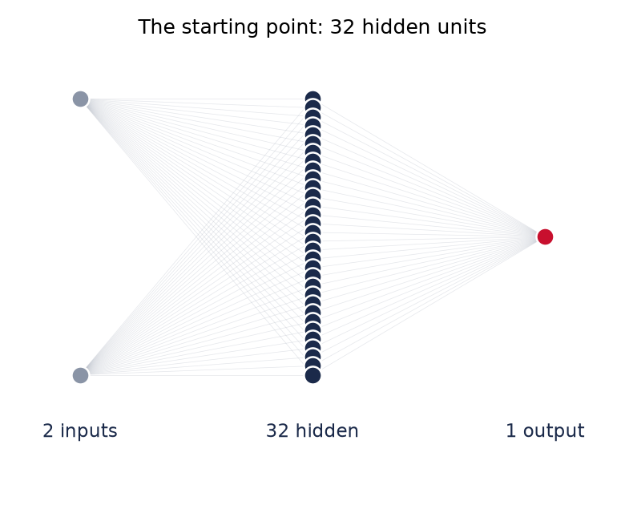
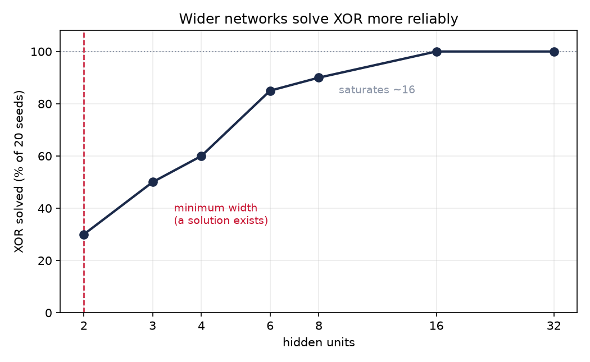
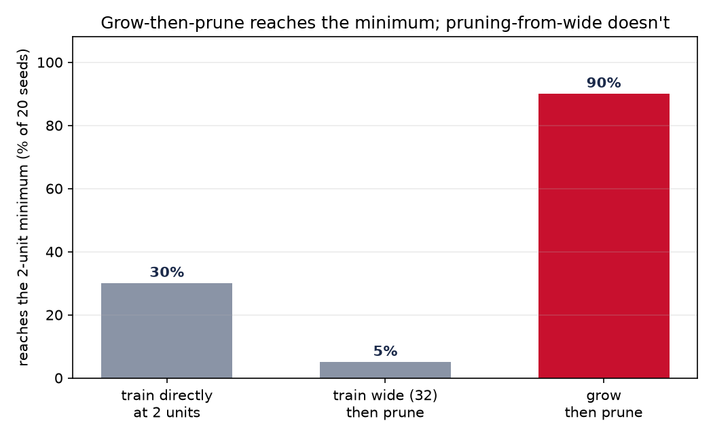
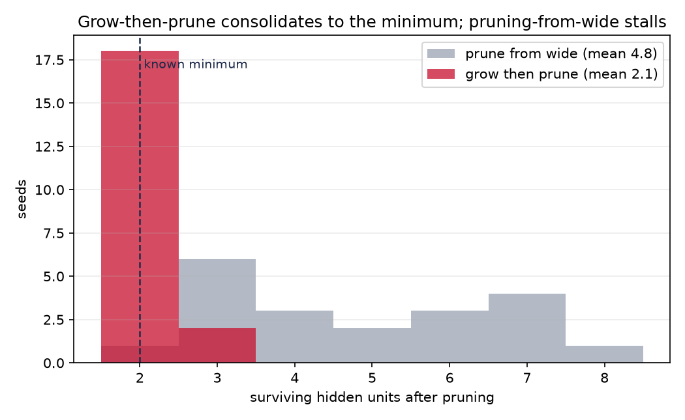

+++
date = '2026-07-01'
draft = true
title = 'Adventures in Computational Neuroplasticity: Structural Plasticity (Part 1)'
summary = "A toy experiment on the oldest trick in the book — build a network too big, then cut it down. It turns out growing one up beats cutting one down, and the reason is more interesting than the result."
tags = ['neural networks', 'pruning', 'plasticity', 'notes']
+++

> Draft. This is a lab-notebook post — a small experiment I ran to build intuition,
> written up honestly, including the part where I discover other people got there first.

<!-- EDIT: your voice — refine freely. -->

Developmental biology tells a striking story about how children's brains grow. A
developing child starts off with far more neural connections than they actually need —
a deluge of them.[^huttenlocher] Over time, the brain sorts through the excess: the
connections that turn out to be helpful are kept, and the ones that aren't are pruned
away and lost for good. The brain sculpts itself down to what works.

[^huttenlocher]: This overproduction-then-pruning pattern was first characterised by
    Peter Huttenlocher: P. R. Huttenlocher, "Synaptic density in human frontal cortex —
    developmental changes and effects of aging," *Brain Research* 163 (1979): 195–205;
    and P. R. Huttenlocher & A. S. Dabholkar, "Regional differences in synaptogenesis
    in human cerebral cortex," *Journal of Comparative Neurology* 387 (1997): 167–178.

I wanted to see whether I could replicate that process in a neural network: build one
bigger than the task needs, then cut it back to the part that does the work. That
cutting-back has a name in machine learning — **pruning** — and it raises an obvious
question. If you prune enough, do you land on the *smallest possible* network for the
task? To check that, you need a task where you already know the smallest network. So I
used the oldest one in the book.

## XOR, and why it's the right toy

XOR is a function of two bits: the answer is 0 if the two inputs match, and 1 if they
differ. Four cases, that's the whole problem.

<table style="margin:1.5rem auto; width:auto; text-align:center;">
  <thead>
    <tr><th style="text-align:center;">A</th><th style="text-align:center;">B</th><th style="text-align:center;">A ⊕ B</th></tr>
  </thead>
  <tbody>
    <tr><td style="text-align:center;">0</td><td style="text-align:center;">0</td><td style="text-align:center;">0</td></tr>
    <tr><td style="text-align:center;">0</td><td style="text-align:center;">1</td><td style="text-align:center;">1</td></tr>
    <tr><td style="text-align:center;">1</td><td style="text-align:center;">0</td><td style="text-align:center;">1</td></tr>
    <tr><td style="text-align:center;">1</td><td style="text-align:center;">1</td><td style="text-align:center;">0</td></tr>
  </tbody>
</table>

It's famous for being the simplest task
a single layer of neurons *can't* solve — you need a hidden layer — and it's known
that **two hidden units are enough**. That known minimum is the whole point: it gives
me a target to check any method against, instead of guessing.

So the setup: a network of `2 inputs → some hidden units → 1 output`. Vary the number
of hidden units, and measure whether it solves XOR. Everything below runs 20 random
starts ("seeds") per setting, because a single run tells you nothing about whether a
method is *reliable*.

Here are the two ends of that range — the smallest network that can solve XOR, and the
deliberately oversized one we start pruning from. Every line is a connection: 6 on the
left, 96 on the right.

  
  

## First surprise: bigger networks are more *reliable*, not just more capable

I trained networks from 2 hidden units up to 32, and counted how often they actually
solved XOR across the 20 seeds.

Two units *can* solve XOR — but only about **30%** of the time. The other 70% of runs
get stuck and never recover. Widen the network and the success rate climbs smoothly,
hitting 100% by around 16 units. Past that, extra width buys nothing.

The reading: a 2-unit network has exactly enough capacity to represent XOR and no
slack. If its random starting point is bad, there's no spare room to escape. Extra
units are extra lottery tickets — the more you have, the likelier *some* subset lands
in a good configuration. **Over-parameterisation buys reliability.**

<!-- EDIT: this is a nice place for a sentence in your voice about what "reliability
     vs capability" means to you — it's the distinction that makes the rest work. -->

## The plan: cut the big one down

Here's the original idea. Train a big (32-unit) network — those solve XOR every time —
then prune it: remove one connection at a time, and keep the removal only if the
network still solves XOR. Repeat until nothing more can go. Because XOR is tiny, I
could do this the expensive, exact way: literally test every connection.

It works — sort of. Every pruned network still solves XOR, and about **85% of the
connections** come out. But it stalls at around **5 hidden units**, not 2. Only 1 in
20 runs reached the true 2-unit minimum.

Why it stalls is the interesting bit. Pruning here is *frozen* — I never let the
remaining connections readjust. So it can only remove connections that were *already*
redundant. The big network spread the XOR solution across ~5 units, and without
retraining, the survivors can't absorb the work of the ones you'd delete. You remove
the slack, then hit a wall.

## The better idea: grow it *up*

So I tried the opposite direction, which was the reader's — sorry, *my* — actual
intuition: don't start big. Start at the minimum (2 units) and train. If it fails to
solve XOR, add one unit and train again. Repeat until it solves. *Then* prune, with
the exact same frozen pruner as before.

The difference is stark.

- Train a 2-unit network directly: reaches the minimum **30%** of the time.
- Train wide, then prune: **5%**.
- **Grow, then prune: 90%.**

Same pruner in the last two. The only thing that changed is the network handed *to*
the pruner. Here's the size distribution the two pruning routes end at:

Grow-then-prune piles up right on the known minimum. Prune-from-wide smears across 3–8.

## Why growing wins

The pruner didn't change, so the *starting solution* must be what matters — and it is.

When you grow a network only as far as it needs, it solves the problem **under
capacity pressure**: it finds a solution using as few units as it can get away with
(here, around 4 before pruning). A solution found in a cramped space is already
*near-minimal in structure* — so the pruner just has to tidy up the last unit or two.

When you train wide, the network solves XOR **with slack to spare**, smearing the job
redundantly across many units. Frozen pruning can remove the obvious redundancy but
can't *consolidate* — it can't merge three lazy units into one busy one, because that
would require retraining.

The weights that end up prunable to the minimum are the ones that were **shaped under
pressure** in the first place.

## The honest part: this isn't new

I'd love to tell you I discovered something. I didn't. Once I had the result I went
looking, and grow-then-prune is a named, decades-old idea — "constructive-and-pruning"
network design, sitting alongside pure-growing and pure-pruning:

- **Growing** networks that add units when stuck: Dynamic Node Creation (Ash, 1989),
  Cascade-Correlation (Fahlman & Lebiere, 1990). (Cascade-Correlation *freezes* each
  new unit once added; mine keeps everything trainable, which makes it closer to the
  former.)
- **Pruning** classics: Optimal Brain Damage (LeCun et al., 1990), and the modern
  lottery-ticket work (Frankle & Carbin, 2019).
- It's still live: a [2025 paper](https://arxiv.org/abs/2509.25665) grows sparse
  networks up rather than pruning dense ones down, and reports the same trade-off I
  hit — growing is cheaper but growth *alone* doesn't reach the extreme sparsity that
  pruning gets. Which is exactly why doing *both* — grow, then prune — lands on a
  minimum that neither reaches alone.

So the finding is a reproduction. What I care about is the framing.

<!-- EDIT: THIS is the section that should be most yours. The developmental / biological
     angle is your actual research direction, so say it in your own words: growth as
     need-driven neurogenesis, pruning as synaptic elimination, the two composed. -->

I came at this from biology, not optimisation. "Add a unit when you're stuck" is a
crude model of **need-driven growth** — the network builds capacity in response to
demand, the way developing brains do. And there's a loose end that points somewhere: I
called the frozen pruner "biologically odd," and it is — real brains never freeze.
Developmental pruning happens *alongside* continuous synaptic adjustment. So the honest
biological version of this experiment wouldn't skip the "healing" step after a cut; it
would do the healing with a *local* learning rule (Hebbian, homeostatic) rather than
backprop. The interesting variable was never *whether* to heal — it's *which rule*
heals.

That's where this goes next.

---

<!-- EDIT: sign-off in your voice. Maybe a line on the "notebook, not paper" spirit —
     small experiments, honestly reported, are underrated. -->

*The code and full write-up (with every caveat) live in my research notes. This was a
morning's experiment; the point wasn't the result, it was the reasoning.*
